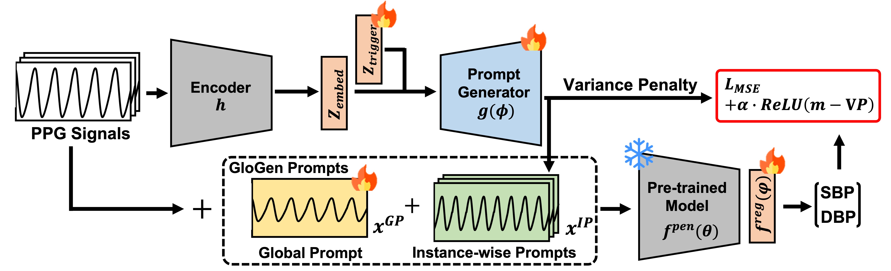
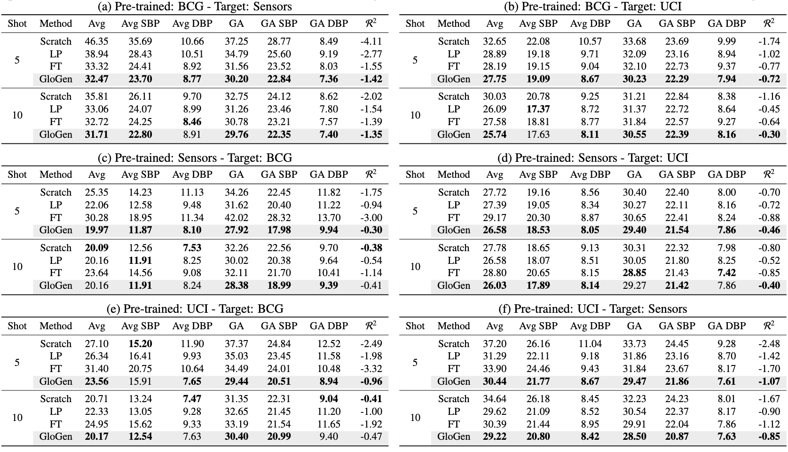

# GloGen

This repository is the official code for **GloGen: PPG prompts for few-shot transfer learning in blood pressure estimation**, published in [Computers in Biology and Medicine](https://www.sciencedirect.com/journal/computers-in-biology-and-medicine) in 2024.





## Dataset Download
Download `UCI`, `Sensors`, `BCG`: https://doi.org/10.6084/m9.figshare.c.6150390.v1

Download `PulseDB` for `MIMIC-III` and `VitalDB`: https://github.com/pulselabteam/PulseDB (Pre-process using MATLAB)

All datasets should be downloaded and unzipped in `[MY_DATASET_PATH]/ppg_bench`

In `[MY_DATASET_PATH]/ppg_bench`, each dataset directory should be named as follows:

`bcg_dataset` / `sensors_dataset` / `uci2_dataset` / `mimic_dataset` / `vitaldb_dataset` 

## Docker Setting

```Bash

#-- root
cd GloGen

#-- Generate docker image
docker build -t [YOUR_IMAGE_NAME] .

#-- Create Docker Container
#-- Example for own port name - 9174-9179:9180-9185.
docker run --gpus=all --shm-size=65g --name=[YOUR_CONTAINER_NAME] -p [YOUR_OWN_PORT_RANGE]:9180-9185 -it -v [YOUR_ROOT]/GloGen/:/bp_benchmark -v [MY_DATASET_PATH]/ppg_bench/:/bp_benchmark/datasets/splitted [YOUR_IMAGE_NAME] bash

#-- Container is started automatically.

#-- Training Test
cd ./code/train

#-- Run Command in sh directory
```

Tips for Docker Users:
```Bash
## TIPS
#-- If you want to exit container with terminating it
exit

#-- If you want to restart container which you exit before with terminating
docker start -ai [YOUR_CONTAINER_NAME]

#-- If you want to exit container without terminating it 
ctrl P
ctrl Q

#-- If you want to re-enter the container which you quit before without terminating
docker attach [YOUR_CONTAINER_NAME]

```

## Training
Refer to .sh files in `./code/train/sh`.

We already provide pre-trained models in `./code/train/pretrained_models`
## Copyright Information

Our work is inspired by the following works:

```
@article{BPbenchmark2023,
    author   = {Gonz{\'a}lez, Sergio and Hsieh, Wan-Ting and Chen, Trista Pei-Chun},
    note     = {(Inventec Corporation work)},
    title    = {A benchmark for machine-learning based non-invasive blood pressure estimation using photoplethysmogram},
    journal  = {Scientific Data},
    volume={10},
    number={1},
    pages={149},
    year={2023},
    publisher={Nature Publishing Group UK London}
}
```
